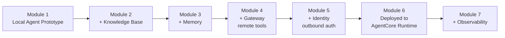

# Building AI Agents with Amazon Bedrock AgentCore and Terraform — From Prototype to Production

A hands-on AWS workshop that takes a single AI agent all the way from a local prototype to a secured, observable, production-grade deployment — using Terraform as the infrastructure-as-code layer throughout.

> Module-by-module notes below are built from the module titles plus how each AgentCore/Terraform concept generally works. As you paste the actual content of each page in, we'll sharpen these into exact instructions rather than general descriptions.

---

## What you're building

A **Customer Support Agent** for a fictional retail company. You start with a bare-bones conversational agent running on your own machine, then incrementally add every capability a real production agent needs: a knowledge base so it answers product questions accurately, memory so it remembers a customer across a conversation, a secure gateway so it can call real backend APIs, identity so those calls are properly authenticated, and finally a managed, observable production runtime.

By the end, the goal isn't just a working agent — it's a working mental model (and working Terraform code) for what "taking an agent to production" actually involves on AWS.

## Why this stack

| Layer | Tool | Why it's here |
|---|---|---|
| Agent logic | [Strands Agents SDK](https://strandsagents.com/) | AWS's open-source, model-first Python framework. You define a model, a system prompt, and a set of tools, and let the LLM handle planning and tool selection itself at runtime — instead of hand-coding a rigid workflow graph the way older frameworks require |
| Model | Claude Sonnet 4.6 (via Amazon Bedrock) | The reasoning engine behind the agent — swappable, since both Strands and AgentCore are model-agnostic |
| Hosting & platform | [Amazon Bedrock AgentCore](https://aws.amazon.com/bedrock/agentcore/) | The managed layer that turns a local agent script into something secure, scalable, and observable in production. Runtime, Memory, Gateway, Identity, and Observability are AgentCore services — not custom infrastructure you'd otherwise have to build and operate yourself |
| Infrastructure | **Terraform** | Every AWS resource the workshop creates — Cognito pools, IAM roles, Lambda functions, AgentCore resources — is defined declaratively in `.tf` files, so what gets deployed is readable, diffable, and version-controlled |

Strands and AgentCore both intentionally support more than this one combination — LangChain or LangGraph instead of Strands, OpenAI or Llama instead of Claude — but this workshop standardizes on one stack so the AWS-specific concepts stay the focus, not framework comparison shopping.

## How the agent evolves through Lab 1

Each module layers on top of the last rather than replacing it. By Module 7 you have one agent that is simultaneously grounded (knowledge base), personalized (memory), capable of real action (gateway), secure (identity), production-hosted (runtime), and monitorable (observability).

## Workshop structure

### AWS Account Setup
Baseline account prerequisites — IAM permissions, Region selection, confirming model access — before any lab-specific work begins.

### Lab 1 — Building AI Agents on Amazon Bedrock AgentCore
The main end-to-end build, in nine modules:

| # | Module | What it adds |
|---|---|---|
| 0 | Bootstrap | Terraform backend/state setup and whatever shared baseline infrastructure the rest of Lab 1 depends on |
| 1 | Creating a simple Customer Support agent Prototype | The bare Strands agent — model + prompt + basic tools, running locally, nothing deployed to AWS yet |
| 2 | Adding a Knowledge Base | Retrieval-augmented generation (RAG), so the agent grounds answers in real product/policy documents instead of relying on the model's own training data |
| 3 | Personalizing the Agent with Memory | AgentCore Memory — short-term session context plus longer-term semantic memory, so the agent recalls who it's talking to and what's already been said |
| 4 | Adding remote tools with AgentCore Gateway | Exposes external APIs (e.g. a warranty-check service) to the agent as callable tools through a managed, MCP-compatible gateway, instead of hardcoding API clients directly into the agent |
| 5 | Securing Outbound Authentication with AgentCore Identity | Manages the credentials the agent needs to call those external APIs on a user's behalf — OAuth tokens, API keys — without embedding secrets in the agent code |
| 6 | Deploying the Agent to AgentCore Runtime | Moves the agent off your laptop onto AgentCore's managed, serverless runtime — the actual "production" step |
| 7 | Monitoring your agents with AgentCore Observability | Wires up CloudWatch tracing so you can see what the deployed agent is actually doing — which tools it called, how it reasoned, where it's slow or wrong |
| 8 | Conclusion and Cleanup | Tears down everything Terraform created, so nothing keeps billing after you're done |

### Lab 2 — AgentCore Gateway Deep Dive
A second, focused lab that treats Gateway as a subject in its own right rather than one step in a bigger build — useful once you want to understand exactly how tool exposure, auth, and policy enforcement work underneath what Lab 1 moved through quickly:

| # | Module | Focus |
|---|---|---|
| 0 | Bootstrap | Standalone Terraform setup for this lab |
| 1 | Understanding AgentCore Gateway | The concepts — what a Gateway is and why agents need one |
| 2 | Your first tool — no auth required | The simplest case: exposing one unauthenticated tool |
| 3 | Adding JWT authentication | Requiring a valid token before a tool can be called |
| 4 | Adding policies | Fine-grained rules over what a given caller may do through the Gateway |
| 5 | Adding interceptors | Custom logic that runs on requests/responses passing through the Gateway |
| 6 | Outbound identity | Gateway-side credential handling for calling backend systems |
| 7 | Using the Gateway with AI agents | Wiring a real agent up to consume Gateway-exposed tools |
| 8 | Observability | Tracing calls as they flow through the Gateway |
| 9 | Conclusion and cleanup | Tear-down |

## Prerequisites

- An AWS account with an IAM identity (not root) with sufficient permissions to create each module's resources
- A Region with full AgentCore support — confirm the exact one once the Account Setup module is in front of us
- Bedrock model access confirmed for the Claude models used
- **Terraform** installed locally (`terraform -v` to check)
- The AWS CLI, configured (`aws sts get-caller-identity` to confirm)
- Python, for the Strands agent code itself

## What you'll actually learn

By the end, you should be able to explain — not just recite — the difference between an agent **framework** (Strands: how the agent thinks and acts) and an agent **platform** (AgentCore: how that agent gets hosted, secured, remembered, connected to tools, and watched once it's live). That distinction is the idea the whole workshop is built around.

## Links

- [Workshop on AWS Workshop Studio](https://catalog.us-east-1.prod.workshops.aws/workshops/05695036-0049-4114-a660-f15071df92dc/en-US)
- [Amazon Bedrock AgentCore](https://aws.amazon.com/bedrock/agentcore/)
- [Strands Agents SDK](https://strandsagents.com/)
- [Amazon Bedrock](https://aws.amazon.com/bedrock)
